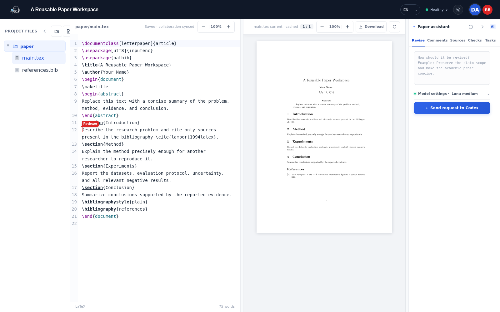
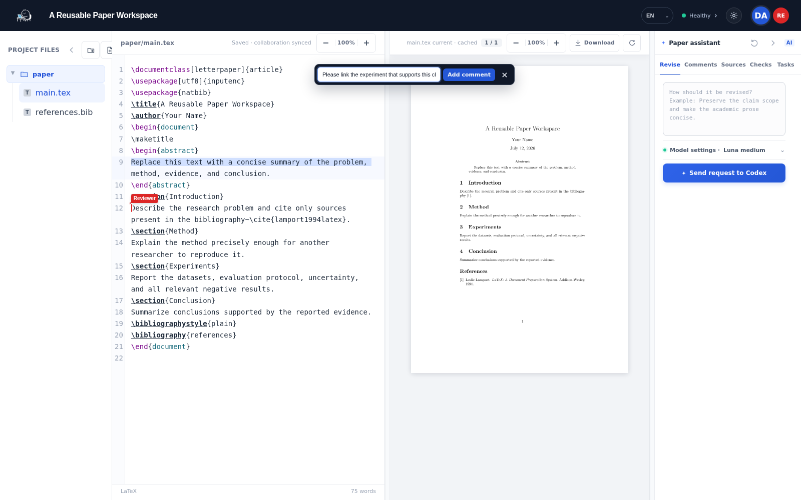
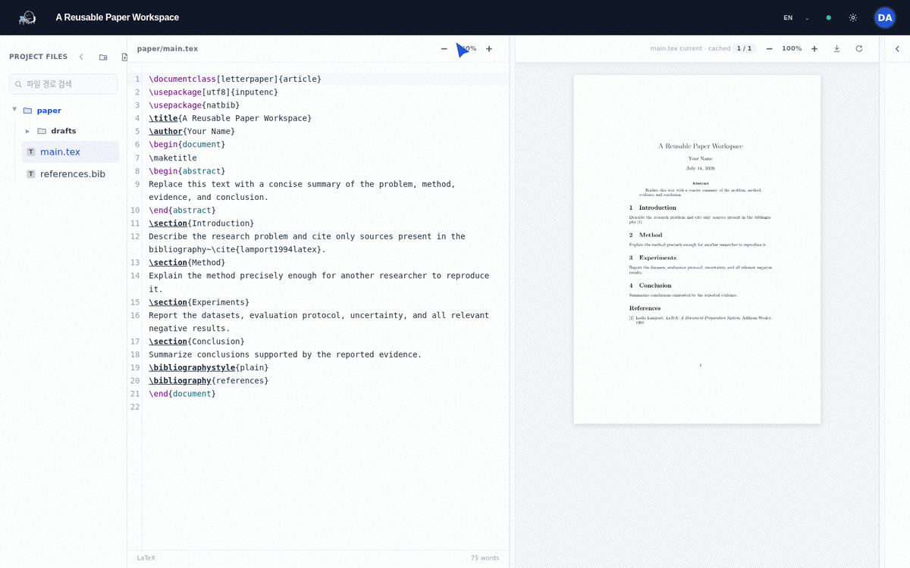

[English](README.md) | **한국어**

# Paper Workspace

브라우저에서 LaTeX를 편집하고, 격리된 TeX Live 컨테이너로 PDF를 만들며, PDF에서 원본 줄로 이동하고, 공동 작업자의 위치와 Codex 수정 제안을 확인하는 self-hosted 논문 작업 공간입니다.

> **현재 범위:** 텍스트, 텍스트 파일 트리, 폴더, 댓글, 할 일은 Yjs CRDT로 공동 편집되고 브라우저 IndexedDB와 서버 LevelDB에 지속됩니다. 브라우저에서 올린 이미지·PDF는 서버 자산 저장소와 IndexedDB에 함께 보관되고 Yjs 메타데이터를 통해 공동 편집자에게 즉시 나타납니다. 변경된 프로젝트는 10분 간격으로 압축된 서버 SQLite 복구 지점을 만들며, 운영 환경에서는 DB·자산과 snapshot export를 서로 다른 외부/NFS 경로에 두는 것을 권장합니다.

LaTeX 편집기는 CodeMirror의 줄 번호, 구문 강조, 괄호 매칭, 검색, 자동완성, undo/redo를 제공합니다. 상단 상태 버튼은 공동 편집·브라우저 저장·PDF·서버 백업 상태를 한곳에서 보여주며, 모바일에서는 파일·원고·PDF·도우미 집중 화면을 전환합니다.

국제 사용자를 위해 UI의 기본 언어는 영어입니다. 저장된 선택이 없고 브라우저 언어가 한국어일 때만 한국어를 자동 선택합니다. 우측 상단 언어 선택기는 화면을 즉시 전환하고 이 브라우저에 선택을 기억합니다. 공유 가능한 언어 고정 링크가 필요하면 허브·로그인·프로젝트 주소에 `?lang=en` 또는 `?lang=ko`를 붙이세요.

## 데모

공개 저장소의 기본 UI와 아래 실제 캡처는 영어로 표시됩니다. 한국어 브라우저에서는 한국어가 자동 선택되며, 우측 상단 언어 선택기에서 언제든 변경할 수 있습니다.

아래 이미지는 실행 중인 Paper Workspace에서 공개 Example Paper를 열고 실제 LaTeX 컴파일과 PDF.js 렌더링이 끝난 뒤 캡처한 화면입니다. 실제 연구 원고, 심사 자료, 실험 결과, 서버 주소나 인증 정보는 캡처에 사용하지 않았습니다.



두 명의 공동 편집자가 같은 원고를 보고, 선택 문장에 바로 댓글을 작성하는 실제 화면입니다.



원고·PDF 동시 보기부터 선택 영역 댓글과 Codex 요청, 제출 전 검사, 저장·공동 편집·PDF·백업 상태 확인까지의 흐름은 다음 애니메이션에서 확인할 수 있습니다.



스크린샷은 정적 목업이 아닙니다. 실제 배포 또는 로컬 실행 환경을 대상으로 다음 명령을 실행하면 같은 흐름을 다시 캡처할 수 있습니다. 인증이 없는 로컬 환경에서는 비밀번호 변수를 생략합니다. ImageMagick의 `convert` 명령이 필요합니다.

```bash
cd apps/paper_workspace/collaboration
PAPER_DEMO_URL=https://localhost \
PAPER_DEMO_PROJECT=example-paper \
npm run capture:demo
```

## 빠른 시작

필요한 것은 Git, Docker Engine, Docker Compose v2입니다. TeX Live 이미지가 크므로 첫 빌드는 수 GB를 내려받을 수 있습니다.

```bash
cp infra/paper-workspace/.env.example infra/paper-workspace/.env
docker compose -f infra/paper-workspace/compose.yaml up --build -d
```

기본 샘플은 `examples/paper-workspace-project`이고 서비스는 로컬 컴퓨터의 `https://localhost`에만 열립니다. 상태와 로그는 다음처럼 확인합니다.

```bash
docker compose -f infra/paper-workspace/compose.yaml ps
docker compose -f infra/paper-workspace/compose.yaml logs -f workspace compiler
docker compose -f infra/paper-workspace/compose.yaml down
```

브라우저가 로컬 Caddy 인증서를 신뢰하지 않으면 개발용 인증서 경고가 표시될 수 있습니다.

## 여러 논문을 한 서버에서 관리

서버 루트는 논문 목록 허브이고, 각 논문은 독립된 주소로 열립니다.

```text
https://paper.example.com/                 논문 목록
https://paper.example.com/p/aaai27         특정 논문 작업공간
https://paper.example.com/p/forecasting    다른 논문 작업공간
```

논문 제목을 URL에 그대로 넣지 않고 영문·숫자·`-`·`_`로 구성된 slug를 사용합니다. 제목은 각 카드와 작업공간 상단에 표시하므로 제목을 수정해도 링크가 깨지지 않습니다. `PAPER_PROJECTS_DIR` 아래에 slug 폴더를 만들고, 폴더 안에 `project.json`과 `main.tex`를 둔 뒤 루트 `index.json`의 `projects` 배열에 카드를 추가하면 됩니다.

```json
{
  "projects": [
    {"slug":"aaai27", "display_name":"AAAI-27 Paper", "description":"Main submission"},
    {"slug":"forecasting", "display_name":"Forecasting Study", "description":"Time-series experiments"}
  ]
}
```

브라우저 초안은 논문 slug별로 분리되고, 협업 커서와 서버 백업도 논문별 ID로 분리됩니다. 기존 단일 논문 설정을 유지하려면 `PAPER_PROJECT_DIR`만 사용할 수 있지만, 목록 허브를 사용하려면 `PAPER_PROJECTS_DIR`를 설정하세요.

## 내 논문 연결

1. 예제 폴더를 Git 밖의 새 폴더로 복사합니다.
2. `main.tex`, `.bib`, 학회에서 직접 받은 `.cls`·`.sty`·`.bst`, 그림을 그 폴더에 둡니다.
3. `project.json`의 `files`에 컴파일에 필요한 파일을 모두 적습니다. 그림은 `{"path":"Figures/plot.pdf","type":"asset"}`처럼 표시합니다. 원본 위치와 컴파일 위치가 다르면 `{"path":"venue.sty","source":"vendor/venue.sty"}`처럼 안전한 상대 경로를 매핑할 수 있습니다.
4. 단일 논문 모드라면 `.env`의 `PAPER_PROJECT_DIR`을 그 폴더의 절대 경로로 바꾸고, 여러 논문 모드라면 `PAPER_PROJECTS_DIR` 아래 slug 폴더로 배치한 뒤 Compose를 다시 시작합니다.

`entrypoint`는 기본 컴파일 문서이며 기본값은 `main.tex`입니다. 파일 경로에는 절대 경로나 `..`를 사용할 수 없습니다. 작업공간에서 어떤 `.tex` 파일을 선택해도 PDF 미리보기를 요청할 수 있습니다. 독립 문서는 그대로 컴파일하고, appendix·section 같은 fragment는 메인 문서의 preamble을 재사용한 임시 wrapper로 선택 부분만 컴파일합니다. `preview_entrypoints`는 독립 문서를 명시적으로 기록하는 선택적 메타데이터이며, fragment 미리보기에는 필요하지 않습니다. 자동 컴파일은 마지막 입력 후 1초에 실행되며, 동일 입력 결과는 10분간 재사용됩니다. 컴파일 API는 최대 120개 파일, 요청 48 MB, binary asset 합계 32 MB를 허용합니다. 브라우저 업로드는 파일당 8 MB로 제한됩니다.

```json
{
  "entrypoint": "main.tex",
  "preview_entrypoints": ["main.tex", "supplement.tex"],
  "page_limit": 7
}
```

보조 문서를 선택한 뒤 PDF 새로고침을 누르면 해당 문서를 `preview.pdf`로 컴파일합니다. 현재 렌더링 대상 파일명은 PDF 패널 상태에 표시되며, 컴파일 결과의 SyncTeX도 선택한 문서 기준으로 원본 위치를 찾습니다.

서버의 프로젝트 파일은 시작 seed입니다. 브라우저에 수정본이 있으면 자동 백업 초안이 만들어질 수 있습니다. 완전히 새 프로젝트로 시작하려면 브라우저 사이트 데이터에서 `paper-workspace` 저장 항목을 지우거나 새 브라우저 프로필을 사용하세요.

## 일상 작업

- 입력 후 자동 저장과 PDF 갱신
- `Cmd/Ctrl+S`, `Cmd/Ctrl+Z`, `Cmd/Ctrl+Shift+Z`
- PDF 본문 클릭으로 SyncTeX 원본 줄 이동
- LaTeX 편집기에서 `Cmd/Ctrl+클릭`으로 대응하는 PDF 위치 이동
- 편집기 또는 PDF 위에서 `Cmd/Ctrl+휠`로 해당 패널만 확대·축소
- 선택 영역의 댓글 또는 Codex 수정 요청
- 파일·폴더 drag-and-drop, PDF 다운로드
- `Figures/` 같은 그림 파일을 클릭해 편집기 자리에서 미리보기·확대/축소·다운로드
- 사이드바·도우미 접기, 각 패널과 편집기/PDF 확대·축소

## 제출 준비 도구

도우미의 **검사** 탭은 현재 브라우저 초안을 기준으로 citation key, label/reference, 익명성 후보, TODO/FIXME, 누락된 그림, PDF 페이지 수와 글꼴 포함 여부를 검사합니다. 결과를 누르면 가능한 경우 해당 소스 줄로 이동합니다. Figure·Table 자산과 BibTeX 항목도 사용·미사용·중복·누락 상태로 모아 봅니다. 자동 검사는 학회 공식 submission checker를 대체하지 않으므로 마지막 제출 때는 공식 검사도 실행하세요.

**Source ZIP 만들기**는 먼저 격리된 컴파일러에서 현재 소스가 정상 컴파일되는지 확인합니다. 성공한 경우에만 소스와 필요한 자산을 ZIP으로 묶고 `SHA256SUMS`를 포함합니다. 서버가 제공하는 큰 원격 자산도 패키지에 포함되며, shell escape와 외부 네트워크를 사용하지 않습니다.

도우미의 **작업** 탭에서는 현재 커서가 있는 파일·줄에 할 일을 연결하고 완료 상태를 관리합니다. 작업 목록은 자동 저장과 서버 snapshot에 포함됩니다. Codex 수정안은 LaTeX 미리보기뿐 아니라 적용 전 원문/수정문 diff를 보여 주며, 요청 이후 원문이 바뀌면 자동 적용하지 않습니다.

## 10분 단위 서버 백업

브라우저의 즉시 자동 저장과 별도로, 내용이 바뀐 프로젝트는 10분마다 서버에 snapshot을 저장합니다. snapshot에는 프로젝트 파일, 댓글, 제목 등 복원에 필요한 편집 상태가 들어가며 PDF와 SyncTeX처럼 다시 생성할 수 있는 출력물은 넣지 않습니다. 기본적으로 프로젝트별 최근 50개를 보관합니다.

백업 DB와 업로드 자산은 기본적으로 Docker named volume `backup_data`에 저장됩니다. 각 snapshot의 압축 JSON 사본은 별도 `backup_exports` volume에도 기록됩니다. 운영 환경에서는 두 source를 서로 다른 디스크나 NFS 경로로 지정하세요.

```dotenv
BACKUP_RETENTION=50
BACKUP_DATA_SOURCE=/mnt/paper-primary
BACKUP_EXPORT_SOURCE=/mnt/offhost-paper-backups
BACKUP_MAX_ASSET_BYTES=16777216
BACKUP_MAX_PROJECT_ASSET_BYTES=134217728
```

`BACKUP_DATA_SOURCE`에는 SQLite DB와 공동 자산이, `BACKUP_EXPORT_SOURCE`에는 프로젝트별 `*.json.zlib` snapshot이 저장됩니다. 외부 경로는 컨테이너 UID 10001이 쓸 수 있어야 합니다. 동일 내용의 자동 백업은 snapshot을 중복 생성하지 않지만 `checked_at`을 갱신해 마지막 정상 확인 시각을 별도로 제공합니다.

백업 기록에서 원하는 시점을 현재 원고와 파일 단위로 비교하거나 복원할 수 있으며, 복원하기 전 현재 상태도 보존합니다. 중요한 시점은 `submission-v1` 같은 이름 있는 체크포인트로 저장할 수 있습니다. 다만 이 기능은 계정 시스템이나 실시간 공동 편집 이력이 아닙니다. 동일한 프로젝트 식별자를 아는 방문자를 구분하지 못하므로 외부 공개 시 반드시 사이트 전체에 인증과 프로젝트 권한 검사를 추가하세요. `docker compose down -v`는 named volume과 모든 snapshot을 삭제하므로 일반 종료에는 `down`만 사용하고, 서버 자체도 정기적으로 별도 백업하세요.

## Codex 연결

Codex는 선택한 문장, 요청 문구, 현재 파일 문맥을 읽고 **적용 전 제안**만 반환합니다. 브리지는 read-only·ephemeral Codex 실행을 사용하며 원고 파일을 직접 수정하지 않습니다.

`.env`에서 다음을 설정합니다.

```dotenv
CODEX_AUTH_FILE=/absolute/path/to/.codex/auth.json
CODEX_BRIDGE_TOKEN=긴-무작위-문자열
HOST_UID=1000
HOST_GID=1000
```

`auth.json`과 `.env`는 절대 커밋하지 마세요. Caddy가 bridge token을 서버 내부에서 주입하므로 브라우저에는 키가 노출되지 않지만, 이것은 방문자 인증이 아닙니다. 외부 공개 시 로그인 보호 없이 Codex를 열면 누구나 운영자 계정의 사용량을 소비할 수 있습니다.

## 외부 공개

권장 방식은 VPN 또는 identity-aware proxy 뒤에서 사용하는 것입니다. 인증 계층을 준비한 후에만 다음 값을 사용하세요.

```dotenv
PAPER_DOMAIN=paper.example.com
PAPER_BIND_ADDRESS=0.0.0.0
```

DNS를 서버로 연결하고 80/443 포트를 허용하면 Caddy가 TLS 인증서를 관리합니다. 컴파일러와 collaboration socket에도 사용자 인증, 프로젝트 권한, 요청 quota가 필요합니다. 현재 구현을 익명 인터넷 서비스로 운영하는 것은 권장하지 않습니다.

### 도메인이 없을 때: Google OAuth

Cloudflare Access는 Cloudflare에서 관리하는 도메인이 필요합니다. 도메인을 준비하지 않은 경우에는 현재 `nip.io` 주소에서도 사용할 수 있는 선택형 Google OAuth 프록시를 사용합니다.

1. Google Cloud Console에서 OAuth Web application을 만들고 callback URL을 `https://YOUR_PAPER_DOMAIN/oauth2/callback`으로 등록합니다.
2. `infra/paper-workspace/.env.auth.example`을 `.env.auth`로 복사하고 Client ID, Secret, cookie secret을 입력합니다.
3. `allowed-emails.example`을 `.auth/allowed-emails`로 복사한 뒤 실제 Google 계정 이메일만 남깁니다.
4. `PAPER_DOMAIN`과 callback URL의 호스트를 동일하게 맞춥니다.
5. 인증 Compose override를 함께 실행합니다.

```bash
docker compose -f infra/paper-workspace/compose.yaml \
  -f infra/paper-workspace/compose.auth.yaml up --build -d
```

`.auth/allowed-emails`에 등록된 Google 계정만 허용됩니다. 인증을 켜면 workspace, 컴파일, 백업, Codex, WebSocket이 모두 같은 로그인 세션 뒤에 놓입니다. 원본 포트(80/443)를 직접 공개하는 환경에서는 인증 프록시를 우회하지 못하도록 방화벽도 함께 설정해야 합니다. 현재는 allowlist 파일을 통한 초대 방식이며, 자동 초대 메일 발송은 SMTP 자격증명을 추가한 후 연결할 수 있습니다.

### 소규모 연구실용 공유 비밀번호

Google 계정 로그인이 부담스럽다면 선택형 password-gate를 사용할 수 있습니다. 한 번 입력하면 `HttpOnly`, `Secure`, `SameSite` 세션 쿠키가 발급되어 설정된 기간 동안 다시 묻지 않습니다.

```bash
cp infra/paper-workspace/.env.password.example infra/paper-workspace/.env.password
```

`.env.password`의 `PAPER_ACCESS_PASSWORD`를 연구실 비밀번호로 바꾸고 긴 `PAPER_SESSION_SECRET`을 설정한 뒤 실행합니다.

```bash
docker compose -f infra/paper-workspace/compose.yaml \
  -f infra/paper-workspace/compose.password.yaml up --build -d
```

모든 사용자가 같은 비밀번호를 공유하므로 개인별 감사·폐기·역할 구분은 제공하지 않습니다. 신뢰하는 소규모 연구실에서만 사용하고, 비밀번호가 노출되면 즉시 교체하세요.

## 폴더 구조

```text
apps/paper_workspace/        UI, compiler, backup, collaboration, Codex bridge
infra/paper-workspace/       Docker Compose, Caddy, nginx
examples/paper-workspace-project/  공개 가능한 최소 예제
docs/paper-platform/         실제 구현과 보안 경계
scripts/paper_platform/      공개 저장소 export/preflight
tests/paper_platform/        회귀 및 공개 경계 테스트
```

현재 연구 원고는 이 구조에 포함되지 않으며 런타임에 `PAPER_PROJECT_DIR`로만 연결합니다.

## GitHub에 공개하기

연구 저장소 전체를 push하지 말고 allowlist exporter를 사용합니다.

```bash
python scripts/paper_platform/export_public_workspace.py /tmp/paper-workspace-public
cd /tmp/paper-workspace-public
git init
git status --short
pytest -q tests/paper_platform
```

exporter는 플랫폼 경로만 복사하고 원고·실험·데이터·결과를 가져오지 않습니다. `.gitignore`는 새 파일을 막을 뿐 이미 추적되거나 과거 commit에 들어간 비밀을 지우지 못합니다. push 전 전체 Git history를 secret scanner로 확인하고, 노출된 인증은 폐기·재발급하세요.

MIT 라이선스는 export된 플랫폼 코드에만 적용됩니다. 연구 monorepo나 사용자가 마운트한 원고에는 자동 적용되지 않습니다. PDF.js의 Apache-2.0 고지는 `THIRD_PARTY_NOTICES.md`와 vendored LICENSE에 보존됩니다.

## 문제 해결

| 증상 | 확인할 것 |
| --- | --- |
| PDF 컴파일 오류 | 오른쪽 로그의 누락된 `.sty`, `.bst`, 그림 경로와 대소문자를 확인하고 모두 manifest에 추가합니다. |
| 인용이 `??` | BibTeX key, `references.bib`, `\\bibliography{...}`를 확인합니다. BibTeX는 aux에 bibliography가 있을 때만 실행됩니다. |
| 서버 파일 수정이 안 보임 | 브라우저 로컬 초안과 project version을 확인하고 `project.json`의 `version`을 올립니다. |
| Codex 401/429/timeout | token, auth file 권한, UID/GID, 10분 요청 제한과 120초 timeout을 확인합니다. |
| 공동 작업자가 offline | Caddy `/collab` reverse proxy와 브라우저 WebSocket 오류를 확인합니다. |
| 백업 기록이 비어 있음 | 첫 snapshot은 변경 후 최대 10분 뒤 만들어집니다. `backup` 컨테이너 로그와 `backup_data` volume을 확인합니다. |
| 백업 복원이 안 됨 | snapshot의 프로젝트 식별자가 현재 프로젝트와 같은지 확인하고 `/api/backups/...` 응답을 확인합니다. |
| 빈 화면/옛 UI | hard refresh 후 사이트 캐시와 localStorage 손상 여부를 확인합니다. 손상된 JSON은 자동 초기화됩니다. |

## 개발 및 검증

```bash
pytest -q tests/paper_platform
node --check apps/paper_workspace/static/app.js
python -m py_compile apps/paper_workspace/compiler/server.py apps/paper_workspace/backup/server.py
node --check apps/paper_workspace/collaboration/client.js
docker compose -f infra/paper-workspace/compose.yaml config --quiet
```

기능 주장은 코드와 테스트로 확인 가능한 범위만 문서화합니다. 향후 과제는 프로젝트별 인증/ACL, 사용자별 감사 이력, 외부 object storage 복제와 정교한 compiler job priority입니다.
